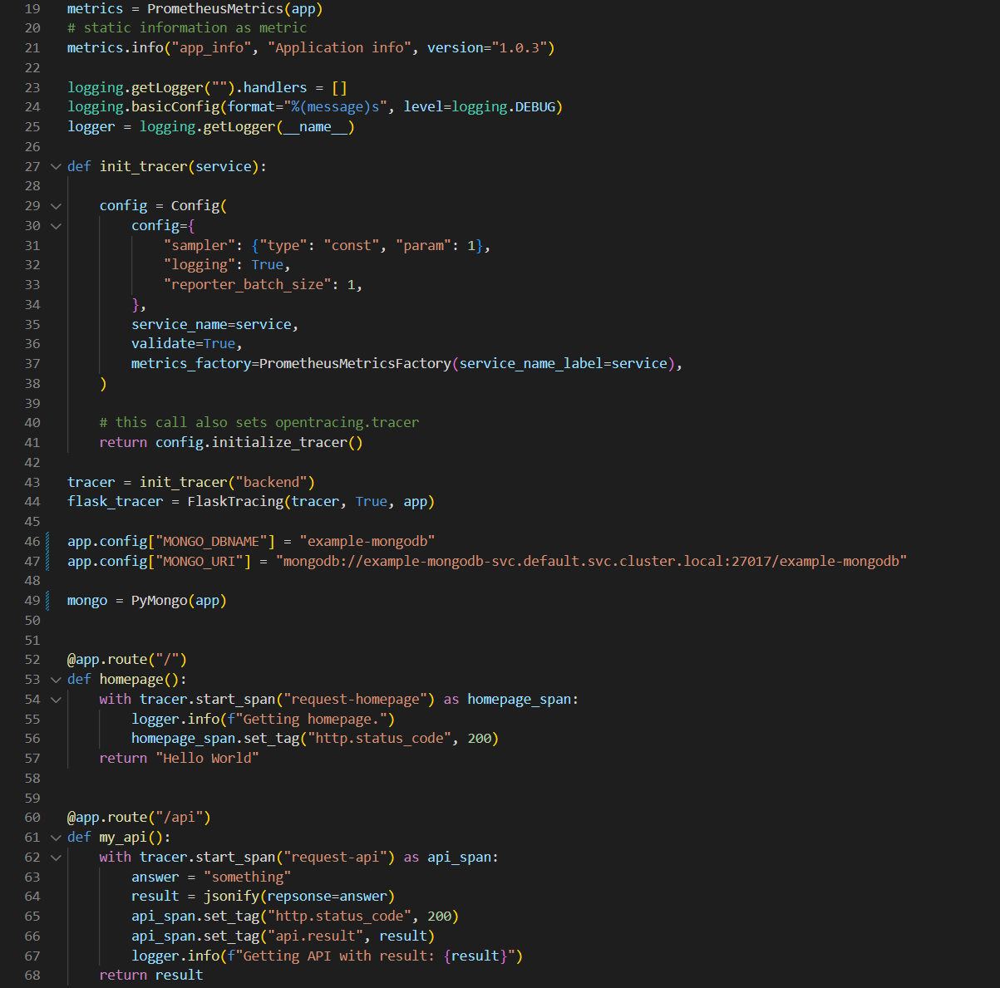
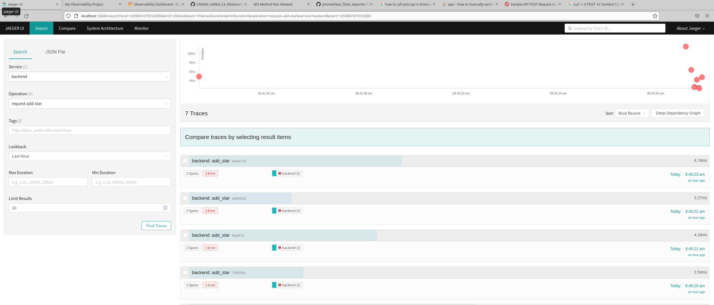

**Note:** For the screenshots, you can store all of your answer images in the `answer-img` directory.

## Verify the monitoring installation

*DONE:* run `kubectl` command to show the running pods and services for all components. Take a screenshot of the output and include it here to verify the installation

Result by: 
kubectl get all -A --field-selector metadata.namespace!=kube-system

## Setup the Jaeger and Prometheus source
*DONE:* Expose Grafana to the internet and then setup Prometheus as a data source. Provide a screenshot of the home page after logging into Grafana.

## Create a Basic Dashboard
*DONE:* Create a dashboard in Grafana that shows Prometheus as a source. Take a screenshot and include it here.

## Describe SLO/SLI
*DONE:* Describe, in your own words, what the SLIs are, based on an SLO of *monthly uptime* and *request response time*.

SLO *monthly uptime*: To validate that we achieve this service level objective (e.g. 98% uptime per month) we might measure the availability of the application, e.g. by calling the health check once a minute or evaluating the http response code. The SLI would be for example 98,4% monthly uptime for the month of May and we would met our SLO in May.

SLO *request response time*: To validate that we achieve this service level objective (e.g. average response time per day less than 250ms) we might measure the time it takes for a customer request to be processes by our application and the answer is send back to the customer. The SLI would be for example 254ms average response time on 5th of May and we would have missed our SLO on that day.

## Creating SLI metrics.
*DONE:* It is important to know why we want to measure certain metrics for our customer. Describe in detail 5 metrics to measure these SLIs. 

'availability' : The ratio the application is available for customers in a defined timeframe (e.g. per month). With this measurement we can see, if our application is stable and can serve our customers at any point in time. This will improve customer satisfaction, reduce customer complaints and by that as well our workload. We will measure this by calling every minute the health check. Receiving an ok we assume the application is up and running. The availability per month is then calculated by (Number of minutes in current month - Number health check NOTOK in current month) * 100 / Number of minutes in current month

'response time' : The response time for every customer request is measured. Based on that we can validate the average response time to get an impression how long it usually takes to provide an answer to the customer. We might as well validate the top 5 response times to see if they are significantly higher than the average response time to investigate what happened at that point in time that the response was taking so long. This will help us to improve the system performance to better serve our customers. 

'error rate' : Ratio of 400s and 500s responses. This will help to identify a service outage even in case the health check is still indication everything is OK.

'concurrent user' : Measure the number of concurrent users that are using our application. High number of concurrent users might be a reason for slow response time and will allow us to better scale our application for the required amount of users. We might as well identify specific time periods (e.g. Christmas Sale, Black Friday) where we have a high amount of concurrent users which will allow us to be better prepared next year.

'page clicks' : Count how often every (sub)page is called. This might give an indication, which pages are outdated or need to be updated. It might help our marketing to adapt prices or better advertisement (e.g. if a page is often called but the offered articels are not bought by the customer)

## Create a Dashboard to measure our SLIs
*DONE:* Create a dashboard to measure the uptime of the frontend and backend services We will also want to measure to measure 40x and 50x errors. Create a dashboard that show these values over a 24 hour period and take a screenshot.

## Tracing our Flask App
*DONE:*  We will create a Jaeger span to measure the processes on the backend. Once you fill in the span, provide a screenshot of it here. Also provide a (screenshot) sample Python file containing a trace and span code used to perform Jaeger traces on the backend service.

## Jaeger in Dashboards
*DONE:* Now that the trace is running, let's add the metric to our current Grafana dashboard. Once this is completed, provide a screenshot of it here.

## Report Error
*DONE:* Using the template below, write a trouble ticket for the developers, to explain the errors that you are seeing (400, 500, latency) and to let them know the file that is causing the issue also include a screenshot of the tracer span to demonstrate how we can user a tracer to locate errors easily.

TROUBLE TICKET

Name: /star endpoint of backend app not working

Date: 29th July 2022 08:07:17 CEST

Subject: MongoDB connection error

Affected Area: /star endpoint of backend app

Severity: Critical

Description: As visible in the Jaeger trace, the endpoint /star of the backen application can be reached. But processing requires a connection to MongoDB database wich is failing. Might be that DB does not exist or connection is very poor.

## Creating SLIs and SLOs
*DONE:* We want to create an SLO guaranteeing that our application has a 99.95% uptime per month. Name four SLIs that you would use to measure the success of this SLO.

- Uptime
- Latency
- Resource Usage
- Errors / error rate 

## Building KPIs for our plan
*DONE*: Now that we have our SLIs and SLOs, create a list of 2-3 KPIs to accurately measure these metrics as well as a description of why those KPIs were chosen. We will make a dashboard for this, but first write them down here.

Uptime:
 - uptime of the frontend pods to check that the frontend is technically running
 - uptime of the backend pods to check that the backend is technically running

Latency:
 - response time for successful requests (in ms) to ensure that customers are not waiting too long for their response
 - response time (slowest 10%) for successful request to see the 

Resource Usage:
 - CPU usage of frontend pods to validate that we have the right pod sizing or need to tune the application
 - CPU usage of backend pods to validate that we have the right pod sizing or need to tune the application
 - Memory usage of frontend pods to validate that we have the right pod sizing or need to tune the application
 - Memory usage of backend pods to validate that we have the right pod sizing or need to tune the application

Errors:
 - Number of 5xx errors as they indicate that there is something fundamental wrong with the application
 - Number of 4xx errors as they indicate that there is something going wrong where we need to have a closer look    

## Final Dashboard
*DONE*: Create a Dashboard containing graphs that capture all the metrics of your KPIs and adequately representing your SLIs and SLOs. Include a screenshot of the dashboard here, and write a text description of what graphs are represented in the dashboard.  

Graph on the left shows the uptime of the frontend (3 pods)

Graph on the right shows the uptime of the backend (3 pods)

You could see unavailability of frontend and backend for a short time around 17:00 cest

Graph on the left shows the average response time for response code 200 (rate(flask_http_request_duration_seconds_sum{status="200"}[30s])

Graph on the right shows the 90% percentile of response time for response code 200 (histogram_quantile(0.9, rate(flask_http_request_duration_seconds_bucket{status="200"}[30s]))

Graph on the upper left shows the CPU utilization of the frontend (rate(process_cpu_seconds_total{endpoint="frontend"}[$__interval])) 

Graph on the upper right shows the CPU utilization of the backend
(rate(process_cpu_seconds_total{endpoint="backend"}[$__interval])) 

Graph on the lower left shows the Memory utilization of the frontend (rate(process_resident_memory_bytes{job="frontend"}[$__interval])) 

Graph on the lower right shows the Memory utilization of the backend (rate(process_resident_memory_bytes{job="backend"}[$__interval])) 

The upper graph shows the number of 200 response code (sum by(endpoint) (flask_http_request_total{endpoint=~"backend|frontend", status="200"}))

Graph on the lower left shows the number of 4xx response code (sum by(endpoint, status) (flask_http_request_total{endpoint=~"backend|frontend", status=~"403|404|404|410"}))

Graph on the lower right shows the number of 5xx response code (sum by(endpoint, status) (flask_http_request_total{endpoint=~"backend|frontend", status=~"500|503"}))

